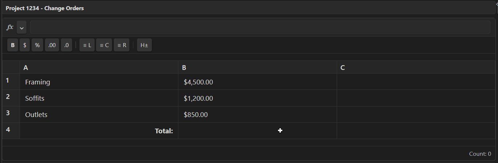
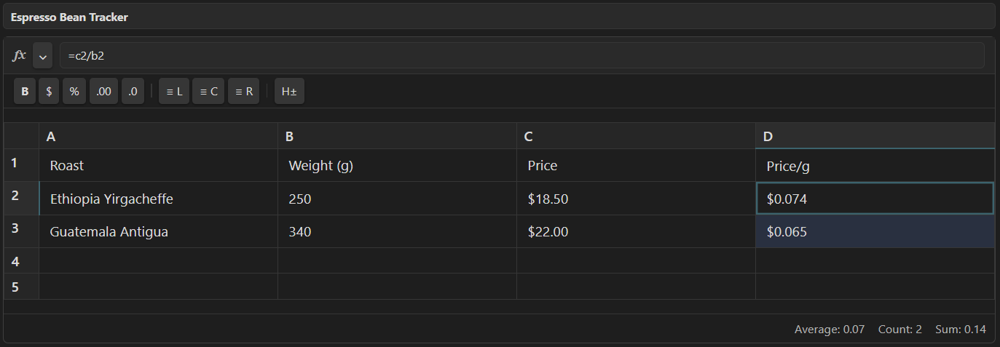

# Obsidian Live Table Formulas


**Live Table Formulas** brings a high-fidelity, Excel-like spreadsheet experience directly to your Obsidian Markdown tables. 

Build dynamic spreadsheets, track budgets, and calculate project estimates right inside your notes with professional tools like formula autocomplete, syntax tooltips, and intelligent drag-to-fill. The best part? The plugin saves everything as standard Markdown under the hood, ensuring your data remains 100% portable.




## ✨ Key Features

* **Real-Time Calculation Engine:** An underlying dependency graph instantly updates downstream cells when you change a value, avoiding circular references (`#CYCLE!`).
* **Formula Autocomplete & Tooltips:** Get instant suggestions as you type functions. Parameter tooltips show you exactly what arguments are needed, highlighting your current position.
* **Intelligent Reference Entry:** 
    * **Point Mode:** Use your keyboard to navigate to and select cell references while typing a formula.
    * **Click-to-Reference:** Simply click a cell to insert its address into your active formula.
* **Advanced Selection & Fill:**
    * **Drag-to-Fill:** Drag the corner handle to copy formulas or extend series.
    * **Double-Click Fill:** Instantly fill formulas down to the bottom of your data block.
    * **Bulk Selection:** Select full rows, columns, or ranges with mouse and keyboard (`Shift`, `Ctrl/Cmd`).
* **Familiar Excel Syntax:** Supports cell references (`A1`), absolute anchors (`$A$1`), and ranges (`A1:B10`). 
* **Smart Formatting:** Built-in support for Currency, Percentages, and Accounting formats.
* **Markdown Native:** The UI overlays a standard Markdown pipe table, storing metadata in a hidden HTML comment to maintain perfect portability.




## 🚀 How to Use

1. Click the **"Insert Live Formula Table"** icon in your ribbon, or use the command palette (`Ctrl/Cmd + P`).
2. Type a code block with the `live-table` language:
   ````markdown
   ```live-table
   | Header 1 | Header 2 |
   | --- | --- |
   | 10 | 20 |
   | =A1 | =SUM(A1:B1) |
   ```
   ````
3. Start any cell or formula bar entry with `=` to begin calculating.


## 🧮 Supported Functions

**Math & Statistical**
* `SUM(...)`, `AVERAGE(...)`, `MIN(...)`, `MAX(...)`
* `COUNT(...)` (numbers), `COUNTA(...)` (values)
* `ROUND(val, digits)`, `FLOOR(val)`, `CEIL(val)`, `ABS(val)`

**Logical**
* `IF(condition, true_val, false_val)`
* `AND(...)`, `OR(...)`, `NOT(condition)`

**Lookup & Reference**
* `VLOOKUP(lookup_value, range, col_index)`

**Text & Date**
* `CONCAT(...)`
* `TODAY()`, `NOW()`


## ⌨️ Keyboard Shortcuts

| Shortcut | Action |
| --- | --- |
| `F2` | Enter cell edit mode |
| `Enter` / `Tab` | Move down / right (commits changes) |
| `Shift + Enter/Tab` | Move up / left |
| `Arrow Keys` | Navigate selection / Point Mode movement |
| `Delete / Backspace` | Clear selected cell contents |
| `Ctrl/Cmd + Z / Y` | Undo / Redo |


## ⚙️ Settings & Customization

* **Currency Symbol:** Customize default currency (e.g., `$`, `€`).
* **Accounting Negatives:** Toggle between `-1,000` or `(1,000)`.
* **UI Toggles:** Hide/show the toolbar, status bar, or row/column headers.
* **Experimental Native Tables:** Enable formulas directly inside standard Obsidian Markdown tables.


## ⚠️ Limitations & Known Issues

* **Cross-Table Referencing:** Formulas are currently scoped to their own table block.
* **Complex VLOOKUPs:** Large tables with thousands of heavy lookup chains may experience minor latency as the engine is synchronous.
* **Clipboard Formatting:** Prioritizes values; complex external cell backgrounds are not yet imported.


## 📥 Installation

**Obsidian Community Plugins**
1. Settings -> Community Plugins -> Browse.
2. Search for **Live Table Formulas**.

**Manual**
1. Download `main.js`, `manifest.json`, and `styles.css` from [latest Release](https://github.com/benju66/obsidian-live-formulas/releases).
2. Place in `.obsidian/plugins/obsidian-live-formulas/`.


## 🤝 Contributing & License

Contributions are welcome! Please open an issue to discuss enhancements.
Licensed under the [MIT License](LICENSE).
