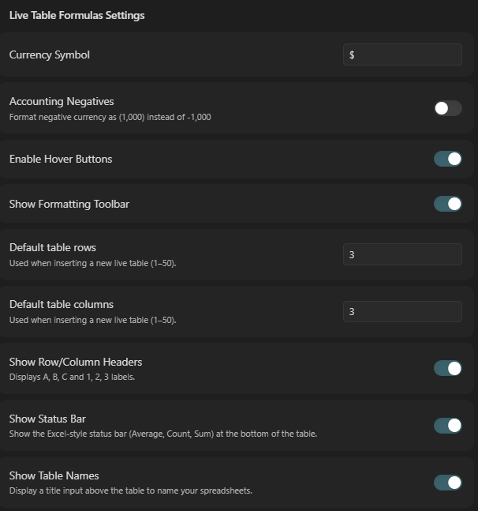

# Obsidian Live Table Formulas


**Live Table Formulas** brings Excel-style inline formulas and live calculations directly to your Obsidian Markdown tables. 

Build dynamic spreadsheets, track budgets, and calculate project estimates right inside your notes. The best part? The plugin saves everything as standard Markdown under the hood, ensuring your data remains 100% portable and readable even if the plugin is disabled.


## ✨ Features

* **Real-Time Calculation Engine:** An underlying dependency graph instantly updates downstream cells when you change a value, avoiding circular references (`#CYCLE!`).
* **Familiar Excel Syntax:** Supports cell references (`A1`), absolute anchors (`$A$1`), and ranges (`A1:B10`). Reference shifting automatically handles cut, paste, and inserting/deleting rows.
* **Smart Formatting:** Built-in support for Currency, Percentages, and Accounting formats (e.g., displaying negative numbers as `(1,000)`).
* **Interactive UI:** Includes an Excel-style status bar (Average, Count, Sum for selected cells) and a formatting toolbar.
* **Markdown Native:** Your data is never locked away in an opaque format. The UI overlays a standard Markdown table, storing metadata in a hidden HTML comment to maintain perfect portability.


## 🚀 How to Use

1. Click the **"Insert Live Formula Table"** icon in your left-hand ribbon, or use the Obsidian command palette.
2. Alternatively, manually type a code block with the `live-table` language:
   ````markdown
   ```live-table
3. Click into any cell and start typing a formula starting with `=`. For example: `=SUM(B2:B5)` or `=B2 * C2`.

## 🧮 Supported Functions

The plugin's math engine supports standard spreadsheet error propagation (`#NUM!`, `#VALUE!`, `#N/A`) and a robust set of standard functions:

**Math & Statistical**
* `SUM(...)`
* `AVERAGE(...)`
* `MIN(...)` / `MAX(...)`
* `COUNT(...)` (Counts numeric values)
* `COUNTA(...)` (Counts non-empty values)

**Logical**
* `IF(condition, true_val, false_val)`
* `AND(...)`, `OR(...)`, `NOT(condition)`

**Lookup & Reference**
* `VLOOKUP(lookup_value, range, col_index)`

**Text & Date**
* `CONCAT(...)`
* `TODAY()` (Returns YYYY-MM-DD)
* `NOW()` (Returns YYYY-MM-DD HH:MM)

## ⚙️ Settings & Customization

You can tailor the spreadsheet experience in the plugin settings:

* **Currency Symbol:** Change the default currency symbol (e.g., `$`, `€`, `£`).
* **Accounting Negatives:** Toggle between `-1,000` or `(1,000)` for negative currency.
* **UI Toggles:** Hide or show the formatting toolbar, row/column headers, status bar, and table names to keep your notes as clean as you prefer.
* **Default Grid Size:** Set the default number of rows and columns when inserting a new table.




## 🧪 Experimental Features

### Native Markdown Table Support (Beta)
By default, this plugin operates safely within its own custom ` ```live-table ` codeblocks. However, for users who prefer Obsidian's standard markdown tables, you can enable **Experimental Native Tables** in the plugin settings.

When enabled, you can type formulas directly into standard Obsidian tables:
| Item | Cost |
| ---- | ---- |
| Apple | 1.50 |
| Banana | 2.00 |
| **Total** | **=SUM(B1:B2)** |

**How it works:**
* **Reading Mode:** Formulas are cleanly calculated and displayed as standard text.
* **Live Preview:** The plugin actively intercepts your cursor position. When you click *into* the table, you will see your raw formulas so you can edit them. When you click *away*, the table instantly evaluates and displays the calculated totals.

**⚠️ Known Limitations & Why it is "Experimental"**
Obsidian’s Live Preview rendering engine is highly complex, rapidly destroying and rebuilding the table UI depending on where your cursor is placed. Because this plugin has to aggressively intercept that rendering pipeline:
* **Visual Flashes:** You may occasionally notice a split-second flash of the raw `=SUM(...)` formula when clicking rapidly in and out of a table before the calculated total renders.
* **Plugin Conflicts:** This feature relies on deep CodeMirror 6 extensions and DOM mutators. It may conflict with other plugins that aggressively alter native markdown tables (e.g., advanced table formatters or sorting plugins).
* **Large File Performance:** While highly optimized to only scan the visible portion of your screen, massive tables with hundreds of complex formulas may introduce slight typing latency in Live Preview.

If you rely on mission-critical spreadsheet behavior or experience visual glitches with native tables, it is highly recommended to use the dedicated ` ```live-table ` block instead. 

*If you test this feature and run into edge cases, please open an issue on GitHub!*

## ⚠️ Limitations & Known Issues

* **Cross-Table Referencing:** Currently, formulas can only reference cells within their own table block. You cannot reference `Table2!A1` from `Table1`.
* **Massive Datasets:** The evaluation engine runs synchronously. While lightning-fast for standard note-taking tables (e.g., 50-100 rows), extreme data sets with thousands of complex `VLOOKUP` chains may cause brief interface stuttering.
* **External Pasting Formatting:** Pasting from external sources (like Google Sheets) currently prioritizes raw values. Cell background colors and complex external formatting will not be imported.

## 📥 Installation

**From Obsidian Community Plugins (Recommended)**
1. Open Obsidian Settings -> Community Plugins.
2. Disable "Safe Mode" if it is currently active.
3. Click "Browse" and search for **Live Table Formulas**.
4. Click Install, then Enable.

**Manual Installation**
1. Download `main.js`, `manifest.json`, and `styles.css` from the [latest GitHub Release](https://github.com/benju66/obsidian-live-formulas/releases).
2. Create a folder named `obsidian-live-formulas` in your vault's `.obsidian/plugins/` directory.
3. Place the downloaded files into that folder.
4. Reload Obsidian and enable the plugin in Settings.

## 🤝 Contributing & License

Contributions, issue reports, and pull requests are highly welcome! Feel free to open an issue on the repository to discuss new functions or UI enhancements.

This project is licensed under the [MIT License](LICENSE). 
```
